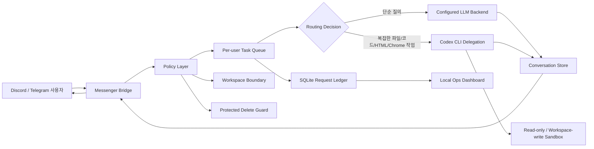

# NyaNya Agent Portfolio Brief

작성일: 2026-06-07

프로젝트명: NyaNya Agent

저장소: https://github.com/hcscat/nyanya-agent.git

형태: Python-first local agent wrapper + Discord/Telegram messenger bridge + local operations dashboard

패키지: `nyanya-agent` 0.1.0, npm wrapper `@hcscat/nyanya-agent` 0.1.0

> 이 문서는 포트폴리오 공개용으로 작성한 설계/구조/기능 설명입니다. 운영 토큰, 사용자 ID, 채널 ID, 개인 워크스페이스 식별자 등 민감 정보는 포함하지 않습니다.

## 1. 한 문장 소개

NyaNya Agent는 개인 또는 소규모 팀의 로컬 작업 환경을 Discord/Telegram과 연결해, 메신저에서 들어온 요청을 로컬 LLM 백엔드 또는 Codex CLI 작업으로 안전하게 라우팅하고, 처리 이력을 로컬 대시보드에서 추적하는 경량 Python 에이전트 운영 계층입니다.

## 2. 만든 이유

일반적인 챗봇은 대화만 처리하고, 로컬 파일 작업이나 개발 도구 실행은 별도의 수동 절차가 필요합니다. 반대로 대형 에이전트 프레임워크는 기능은 강하지만 설치, 운영, 권한 관리가 무겁습니다.

NyaNya Agent는 그 중간 지점을 목표로 합니다.

- Discord나 Telegram에서 바로 작업을 요청한다.
- 단순 질의는 설정된 기본 LLM 백엔드로 빠르게 처리한다.
- 파일 분석, HTML/문서 생성, 코드 수정, 브라우저/Chrome 관련 작업처럼 복잡한 요청은 Codex CLI로 위임한다.
- 작업 범위는 허용된 워크스페이스 루트로 제한한다.
- 운영 비밀값은 로컬 `.env`에만 둔다.
- macOS LaunchAgent로 지속 실행할 수 있게 한다.
- Discord에서 요청한 작업의 상태, 결과, 소요시간, 사용 모델을 로컬 dashboard에서 확인한다.

## 3. 핵심 사용자 경험

### Discord 사용 방식

- `!nyanya 질문`: prefix 기반 호출
- `@nyanya 질문`: 멘션 기반 호출
- `!nyanya upload <파일 경로>`: 로컬 파일을 Discord 채널에 업로드
- `!nyanya codex 검수/조사 내용`: Codex CLI 읽기 전용 위임
- `!nyanya codex-work 파일 생성/수정 요청`: Codex CLI 쓰기 작업 위임
- `!nyanya status`, `!nyanya config`, `!nyanya resources`: 운영 상태 확인
- `!nyanya 취소`: 사용자의 진행/대기 작업 취소

### 운영자 사용 방식

- `./scripts/nyanya_ctl.sh check`: 백엔드와 Discord 설정 점검
- `./scripts/nyanya_ctl.sh restart`: LaunchAgent 재시작
- `./scripts/nyanya_ctl.sh status`: 서비스 상태 확인
- `./scripts/nyanya_ctl.sh status-all`: Discord bridge, dashboard, Codex 분리 상태 확인
- `./scripts/nyanya_ctl.sh deep-health`: Discord API, dashboard HTTP, backend, smoke check 통합 검증
- `./scripts/nyanya_ctl.sh dashboard-start`: 로컬 dashboard 실행
- `./scripts/nyanya_ctl.sh bot-name <name>`: Discord 봇 사용자명 조회/변경

## 4. 전체 아키텍처



핵심은 메신저 입력을 바로 실행하지 않고, `Bridge -> Policy -> Queue -> Routing -> Backend` 단계를 거치게 만든 점입니다.

## 5. 소스 구조

```text
src/nyanya_agent/core.py              # CLI, provider 호출, 세션 저장, 시스템 프롬프트 조립
src/nyanya_agent/discord_bridge.py    # Discord 이벤트 수신, prefix/mention 트리거, 파일 업로드
src/nyanya_agent/telegram_bridge.py   # Telegram long polling bridge
src/nyanya_agent/bridge_store.py      # 대화 저장소, per-user task queue, 홈워크스페이스 매핑
src/nyanya_agent/bridge_runtime.py    # Codex 위임, 자동 라우팅, 리소스 조회, 실행 제한
src/nyanya_agent/bridge_policy.py     # 워크스페이스 경계, 보호 경로, 명령어 도움말
src/nyanya_agent/bridge_constants.py  # 명령어/키워드/기본 정책 상수
src/nyanya_agent/dashboard_store.py   # SQLite 요청/이벤트/프로젝트 단계 ledger
src/nyanya_agent/dashboard_api.py     # FastAPI 기반 local dashboard API
src/nyanya_agent/dashboard_static/    # dashboard HTML/CSS/JS
src/nyanya_agent/manager.py           # macOS 서비스 관리, Discord bot-name API
scripts/                              # 실행/설치/점검 shell scripts
config/                               # 기본 JSON 설정과 사용자 워크스페이스 매핑
prompts/                              # 시스템 프롬프트
docs/                                 # 운영/공개 정책/포트폴리오 문서
```

## 6. 실행 흐름

### 6.1 Discord 메시지 처리

1. `discord_bridge.py`가 Discord Gateway 이벤트를 수신한다.
2. 봇 자신이 보낸 메시지는 무시한다.
3. DM, `!nyanya` prefix, `@nyanya` 멘션, 허용 채널 자동 응답 설정 여부를 기준으로 응답 여부를 결정한다.
4. 채널/사용자가 허용 목록에 있는지 확인한다.
5. 첨부파일이 있으면 허용된 워크스페이스 하위에 저장하고, 모델에게 사용할 로컬 경로를 컨텍스트로 제공한다.
6. 명령어인지 일반 요청인지 판별한다.
7. dashboard ledger에 요청 레코드를 생성한다.
8. 일반 요청은 `NyaNyaConversationStore.submit()`으로 전달한다.
9. 작업 큐가 즉시 실행 가능하면 백그라운드 thread에서 처리하고, 아니면 사용자별 대기열에 넣는다.
10. 처리 상태, 결과 요약, 시작/종료/소요시간을 dashboard ledger에 기록한다.
11. 처리 결과를 Discord 메시지로 나눠 전송한다.

### 6.2 모델 호출

`core.py`는 provider를 추상화합니다.

- `gemini_cli`: Google Gemini CLI 또는 Antigravity 호환 CLI 호출
- `ollama`: 로컬 Ollama API 호출
- `openai_compatible`: OpenAI 호환 `/v1/chat/completions` 호출

현재 운영 기준에서는 Gemini CLI 계열이 기본 백엔드로 설정되어 있고, Ollama는 보조/복구 경로로 남겨둔 구조입니다.

### 6.3 Codex 위임

복잡한 요청은 `bridge_runtime.py`가 Codex CLI로 위임합니다.

자동 위임 기준은 다음 신호를 조합합니다.

- 파일명 또는 파일 경로가 포함된 요청
- `html`, `보고서`, `분석`, `코드`, `테스트`, `디버그`, `zip` 등 작업 키워드
- 파일 생성/수정/삭제 요청 여부
- Chrome/브라우저 조작 요청 여부
- 요청 길이와 복잡도

위임 시에는 작업 경로, 허용 워크스페이스 루트, 보호 삭제 경로, read-only/write 가능 여부를 Codex 프롬프트에 명시합니다.

## 7. 보안/안전 설계

NyaNya Agent는 완전한 sandbox가 아니라, 로컬 에이전트 앞단의 정책 계층입니다. 따라서 “무엇을 막고, 무엇을 명시적으로 제한할지”가 핵심 설계 포인트입니다.

### 7.1 워크스페이스 경계

- `NYANYA_WORKSPACE_ROOTS`로 허용 루트를 제한한다.
- 상대 경로는 기본 워크스페이스 기준으로 해석한다.
- 사용자별 홈워크스페이스를 지정할 수 있다.
- 허용 루트 밖 경로는 읽기/수정/요약 대상에서 제외한다.

### 7.2 보호 삭제 경로

`.env`, `src`, `config`, `prompts`, `scripts`, `pyproject.toml`, `package.json` 등 런타임 핵심 경로는 보호 목록에 둡니다. 사용자가 삭제/이동/이름 변경/초기화처럼 해석될 수 있는 요청을 하면, 실행 전에 거부합니다.

### 7.3 비밀값 관리

- Bot token, API key, OAuth 관련 값은 `.env`에만 둔다.
- 문서/로그/Discord 응답에 토큰을 출력하지 않는다.
- 공개 자료에는 `.env.example`만 사용한다.

### 7.4 작업 큐와 취소

- 사용자별 현재 실행 작업 1개
- 사용자별 대기 작업 기본 2개
- `취소`, `cancel`, 관리자용 `전체취소`, `사용자취소` 지원
- 취소 이벤트는 외부 CLI subprocess에도 전달한다.

### 7.5 대시보드와 감사 로그

- Dashboard DB는 로컬 SQLite를 사용한다.
- 요청 본문, 처리 상태, provider/model, 시작/종료/소요시간, 결과 요약을 기록한다.
- Gemini/Codex CLI가 안정적인 token usage를 제공하지 않는 경우 토큰 필드는 추정하지 않고 빈 값으로 둔다.
- `data/`, `logs/`, `sessions/`, `downloads/`는 공개 git 대상에서 제외한다.

## 8. 기능 상세

| 영역 | 기능 | 구현 위치 |
|---|---|---|
| CLI | 일회성 prompt, REPL, 세션 저장, backend check | `core.py` |
| Discord | prefix/mention/DM, 첨부 저장, 파일 업로드, 채널 허용 | `discord_bridge.py` |
| Telegram | Bot API long polling, 명령어 처리 | `telegram_bridge.py` |
| 대화 상태 | 채널/사용자별 message history, 최대 메시지 유지 | `bridge_store.py` |
| 작업 큐 | 사용자별 실행/대기/취소 | `bridge_store.py` |
| 대시보드 | 요청 ledger, 사용량 추이, 프로젝트 단계 검증 | `dashboard_store.py`, `dashboard_api.py`, `dashboard_static/` |
| Codex 위임 | read-only/write sandbox, 자동 라우팅 | `bridge_runtime.py` |
| 리소스 조회 | CPU/메모리 상위 프로세스 테이블 | `bridge_runtime.py` |
| 워크스페이스 정책 | allowed roots, protected paths, home workspace | `bridge_policy.py` |
| 운영 관리 | LaunchAgent 설치/재시작/상태, bot username 변경 | `manager.py`, `scripts/` |

## 9. 기술 선택

### Python-first

메신저 브릿지, subprocess 제어, 파일시스템 정책, 로컬 CLI 호출을 다루기 위해 Python을 주 언어로 선택했습니다. 표준 라이브러리 기반 구현을 넓게 사용해 배포 복잡도를 줄였습니다.

### discord.py

Discord Gateway 이벤트 처리와 파일 업로드에는 `discord.py`를 사용합니다. 메시지 content intent를 켜고, prefix와 mention trigger를 직접 판별합니다.

### Shell scripts + LaunchAgent

macOS에서 장기 실행 서비스를 안정적으로 다루기 위해 LaunchAgent를 사용합니다. 사용자는 Python 명령을 직접 외우지 않고 `nyanya_ctl.sh`로 점검/재시작/상태확인을 수행합니다.

### npm wrapper

프로젝트는 Python 기반이지만 npm wrapper를 제공합니다. 이는 JavaScript/Node 생태계 사용자에게 설치 진입점을 낮추기 위한 선택입니다. 실제 런타임은 Python package를 실행합니다.

## 10. 포트폴리오 관점의 기술적 포인트

### 10.1 작은 코드베이스로 운영 가능한 에이전트 시스템 구성

대형 프레임워크를 그대로 가져오기보다, 필요한 표면을 직접 설계했습니다. 코드 수를 작게 유지하면서도 메신저, 작업 큐, 파일 업로드, Codex 위임, 서비스 관리까지 운영 흐름을 완성했습니다.

### 10.2 메신저와 로컬 개발 환경 연결

Discord는 단순 알림 채널이 아니라 로컬 개발 자동화의 UI가 됩니다. 사용자는 모바일/데스크톱 Discord에서 요청하고, 에이전트는 Mac mini의 로컬 워크스페이스와 CLI 도구를 활용합니다.

### 10.3 정책 기반 라우팅

모든 요청을 같은 모델에 보내지 않습니다. 단순 질의는 빠른 기본 백엔드, 복잡한 파일/코딩/문서 작업은 Codex CLI로 보내는 하이브리드 구조를 사용합니다.

### 10.4 안전 경계 설계

로컬 파일 접근이 가능한 에이전트는 위험할 수 있습니다. NyaNya Agent는 허용 루트, 보호 삭제 경로, read-only/write sandbox, 사용자별 홈워크스페이스로 기본 경계를 둡니다.

### 10.5 실제 운영 가능한 도구화

`check`, `status`, `restart`, `bot-name`, LaunchAgent 설치/삭제 스크립트를 제공해 “데모 코드”가 아니라 계속 켜두고 쓰는 운영 도구로 구성했습니다.

### 10.6 운영 관측성 추가

Discord 요청이 접수된 뒤 큐, 실행, 완료/실패 상태가 SQLite ledger에 남고, dashboard에서 요청 이력과 일/주/月 사용량 추이를 확인할 수 있습니다. 프로젝트 단계를 기획/설계/구현/테스트로 나누고 다음 작업 확인이 필요한 경우 Discord confirmation 흐름으로 연결할 수 있게 설계했습니다.

## 11. 현재 운영 상태 요약

- 내부 표시명: `NyaNya Agent`
- Discord 봇 사용자명: `nyanya`
- 서버 표시 닉네임: `nyanya`
- Discord 호출 방식: `!nyanya`, `@nyanya`
- 기본 provider: Gemini CLI 계열
- 복잡 작업 위임: Codex CLI
- macOS 서비스: LaunchAgent 기반 Discord bridge
- 로컬 dashboard: FastAPI + SQLite, `http://127.0.0.1:8765`
- DB 선택: 단일 Mac mini 로컬 운영에는 SQLite/WAL이 PostgreSQL 또는 NoSQL보다 단순하고 효율적

## 12. 향후 개선 방향

- dashboard 인증/권한과 reverse proxy hardening
- 명령어/권한 정책을 YAML 또는 TOML로 분리
- 작업 결과 artifact 인덱싱과 검색
- Discord slash command 지원
- 테스트 확대: 라우팅 정책, Discord 이벤트 핸들러, dashboard API contract
- 배포 방식 개선: uv tool, Homebrew tap, standalone app 패키징

## 13. 요약

NyaNya Agent는 “로컬 개발 환경을 메신저에서 안전하게 호출하는 작은 에이전트 운영 계층”입니다. 핵심 가치는 거대한 에이전트 프레임워크를 단순히 설치한 것이 아니라, 실제 개인 워크플로우에 필요한 브릿지, 정책, 라우팅, 운영 자동화를 직접 설계하고 구현했다는 점입니다.
